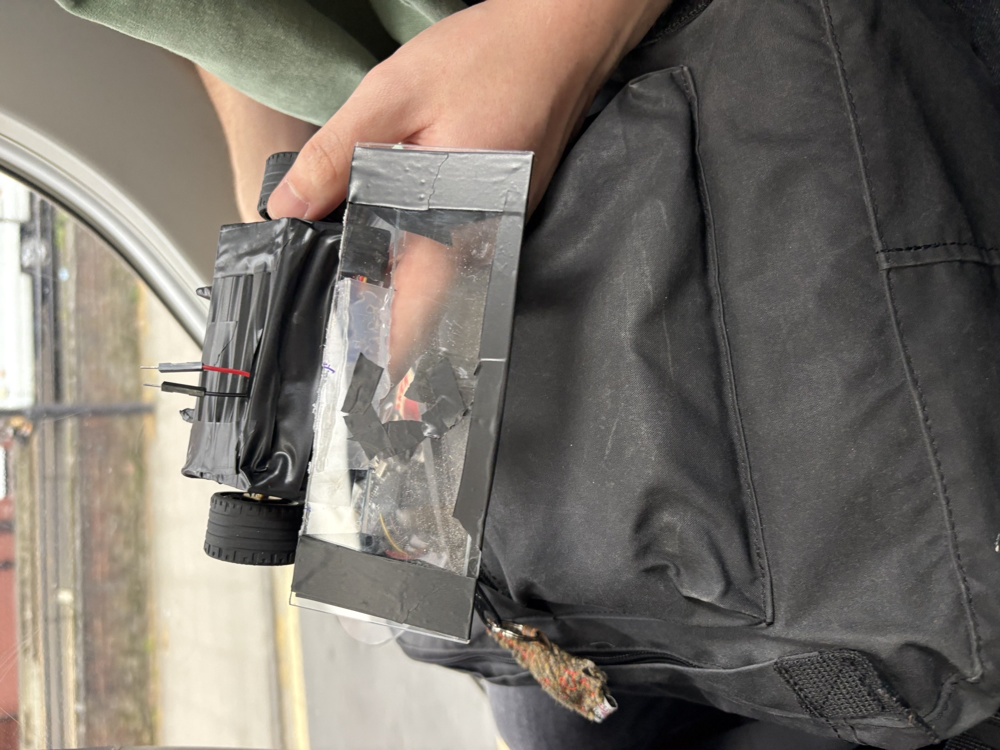

# The Captain -robot

## Overview

The Captain is a UK antweight combat robot built by a small team of friends. It was designed to stay within the 150 g class while still fitting in a two wheel drive setup, a servo-powered flipper, and a fully custom wireless controller.

The drive system uses two N20 gear motors controlled through a DRV8833 motor driver. Onboard control is handled by an ESP32 Mini, while a second ESP32-based handheld remote sends commands wirelessly using ESP-NOW over Wi-Fi. Voltage is regulated through a buck converter, which also helps power the servo flipper.

## Hardware Summary

- Weight class: 150 g antweight
- Drive: 2x N20 gear motors
- Motor driver: DRV8833
- Robot controller: ESP32 Mini
- Handheld controller: ESP32-based remote
- Wireless link: ESP-NOW
- Weapon: servo flipper
- Power regulation: buck converter for controlled voltage and servo support

## How It Works

The handheld controller reads joystick and button inputs, packages them into a data packet, and transmits them to the robot over ESP-NOW. The robot receives those packets and uses them to drive the left and right motors independently, while the servo flipper is triggered from the controller buttons.

This repository contains the firmware for both halves of the system:

- `the_controller/` contains the code for the handheld transmitter.
- `the_brain/` contains the code that runs on the robot itself.
- `photos/` contains build and finished photos, plus a short combat clip.

## Team

The Captain was built by:

- Dylan
- Theo Bailey
- Nicursor-Paul Ghinea

## Gallery

- Finished robot: `photos/Finished.jpeg`
- Early prototype: `photos/first_prototype.jpeg`
- Final prototype: `photos/Final_prototype.jpeg`
- Combat clip: `photos/combat.mov`
