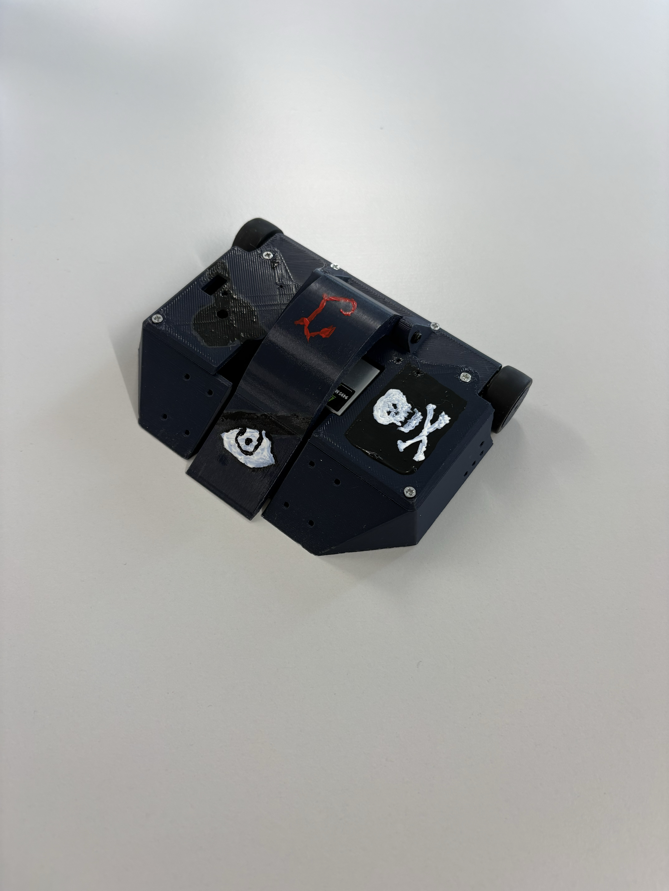
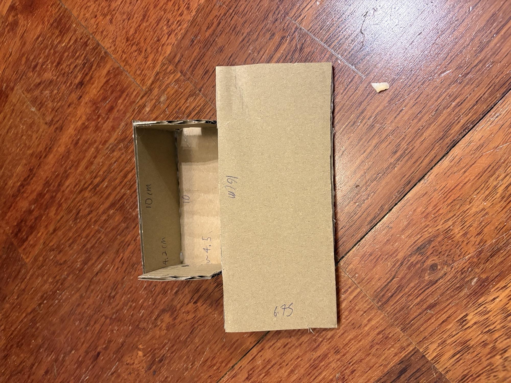
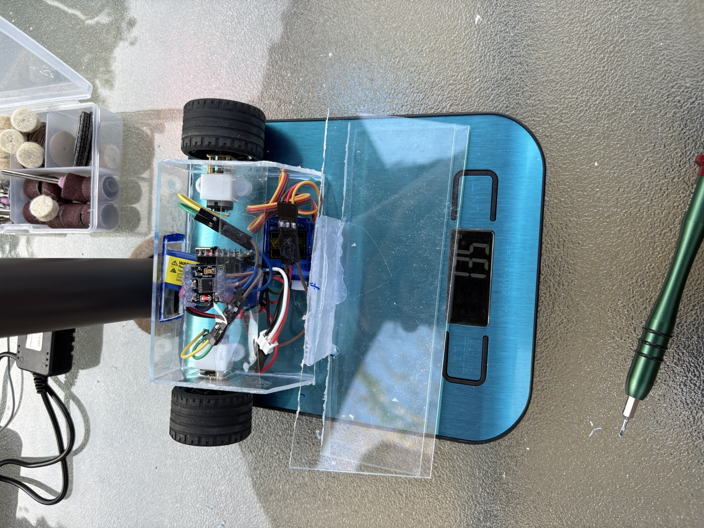
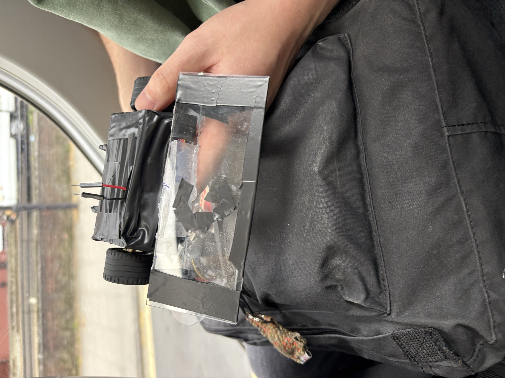
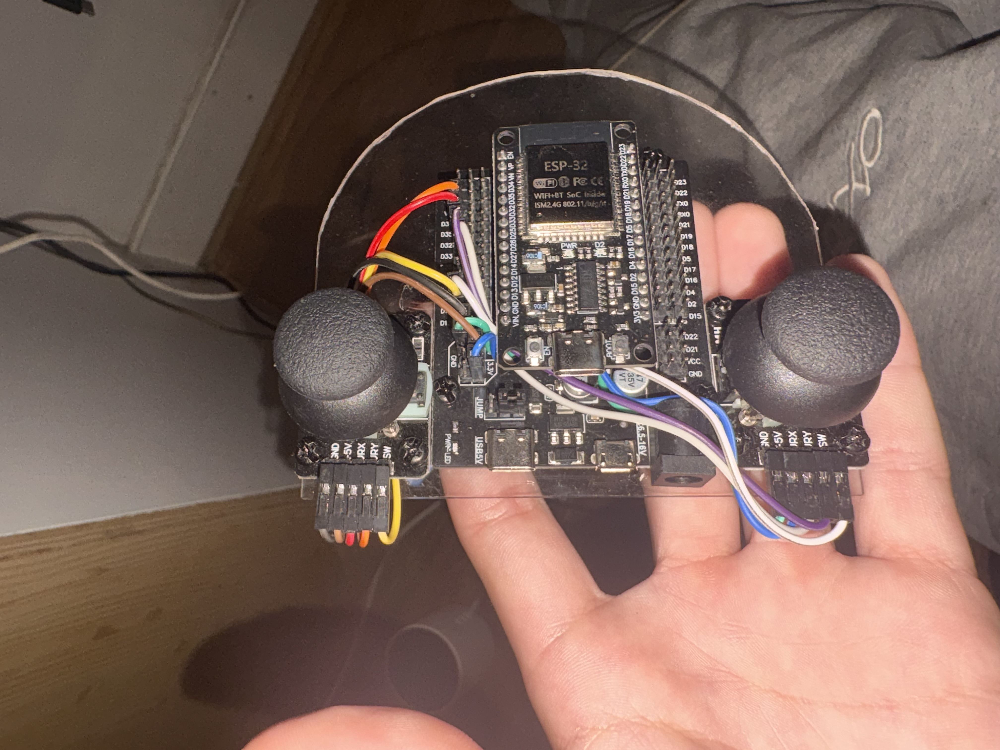

# The Captain

> A 150 g UK antweight combat robot built around ESP32-C3 control, two-wheel drive and a servo-powered flipper.

  

The Captain was developed by a three-person team for **Rock and Robots**. The project progressed from a cardboard prototype to two competition versions, using the results from V1 to guide a substantial mechanical redesign for V2.

V1 finished its competition with a 0–3 record. V2 won two of its three fights and reached the playoffs.

## Competition results

| Version | Weight | Outcome | Main focus |
| --- | ---: | --- | --- |
| V1 | 135 g | 0–3 | First competition-ready design |
| V2 | 142 g | 2–1 and reached the playoffs | Improved recovery, traction, flipper speed and connection reliability |

Both versions remained below the UK antweight limit of 150 g.

## From V1 to V2

The V2 redesign concentrated on problems revealed during V1's fights:

- **Getting stranded upside down:** the chassis and flipper geometry were redesigned to improve the robot's ability to recover.
- **Limited traction:** the wheel design was changed to provide better grip.
- **Slow flipping action:** a faster servo and revised flipper geometry produced a stronger, quicker mechanism.
- **Weight distribution:** the internal components were repositioned in line with the motors.
- **Unreliable connections:** temporary jumper wires were replaced with soldered connections throughout the robot.

The V2 chassis was designed primarily by **Nicursor-Paul Ghinea** in Tinkercad, printed by Nic and assembled by **Dylan Moffett**.

## How it works

A custom handheld controller reads two joysticks and the flipper buttons, then sends a control packet to the robot over **ESP-NOW** at 50 Hz. The robot validates the controller ID, converts the received commands into independent left- and right-motor outputs, and controls the flipper servo.

The inexpensive joysticks produced noisy values, so their output was intentionally divided into five fixed levels: **0%, 25%, 50%, 75% and 100%**. This made control more predictable, although less precise than fully proportional input.

## Hardware

| Component | Specification |
| --- | --- |
| Robot controller | Diymore ESP32-C3 Dev Board Mini |
| Handheld controller | Diymore ESP32-C3 Dev Board Mini |
| Drive motors | 2 × N20, 6 V, 500 RPM |
| Motor driver | DRV8833 dual H-bridge |
| Weapon | Servo-powered flipper |
| Battery | 300 mAh 2S LiPo, 7.4 V |
| Power regulation | Adjustable buck converter |
| Chassis | Custom 3D-printed V2 design |

## Firmware

The firmware is written in **C using ESP-IDF** and was shared between V1 and V2. It includes:

- ESP-NOW communication between the controller and robot
- 50 Hz controller updates
- 20 kHz PWM motor control
- independent differential drive commands
- servo control for the flipper
- a robot ID field in each command packet

The current firmware does **not** include a link-loss watchdog. If communication is interrupted, the robot may retain its most recent motor command. Adding a timeout that forces both motors to stop would be the first safety improvement for any future version.

## Testing and debugging

Development included bench testing, steering tests and practical driving tests before competition.

One of the most time-consuming faults appeared to be a software problem but was ultimately hardware-related. A buck converter had not been set correctly and a DRV8833 motor driver was damaged. After spending significant time debugging the firmware, the team traced the failure to the power system. The main lesson was to verify supply voltages and hardware health before assuming a control problem is caused by code.

## Team

| Team member | Contributions |
| --- | --- |
| **Dylan Moffett** | Firmware, wiring and soldering, component selection, assembly and driving |
| **Nicursor-Paul Ghinea** | Primary V2 CAD design, firmware, soldering, 3D printing and debugging |
| **Theo Bailey** | Assembly, soldering and testing |

## Development gallery

### 1. Cardboard prototype

The first physical prototype was used to explore the basic V1 layout.

  

### 2. V1 prototype

  

### 3. V1 before competition

  

### 4. V1 in combat

[Watch V1 compete](photos/combat.mov)

### 5. V2 redesign

  

### 6. Custom controller

  

## Repository scope

This repository is an engineering case study rather than a complete reproduction guide. It contains the robot and controller firmware, but the original CAD files and a complete wiring diagram are not currently available.

## What I would change next

For a hypothetical V3, I would:

- add a communication timeout that immediately stops the drive motors
- use higher-quality joysticks for smoother proportional control
- document the wiring and power system before assembly
- replace the flipper concept with a simpler design focused on traction, drive power and durability

The Captain is now retired, but the project demonstrated how competition feedback, systematic debugging and rapid mechanical iteration can turn an unsuccessful first version into a playoff robot.

The name and pirate theme were inspired by Captain Morgan during the team's original design night.

## License

This project is licensed under the [MIT License](LICENSE).
